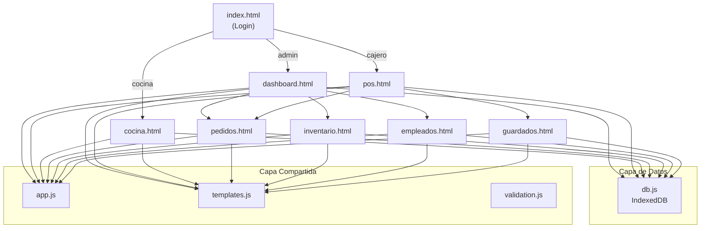

# 🍕 Análisis Completo — ERP Mamma Tomato

## Descripción General

Sistema ERP para la pizzería **Mamma Tomato Pizza & Focaccia** (Lima, Perú). Es una aplicación web **frontend-only** que usa **IndexedDB** como base de datos local, con arquitectura Multi-Page (cada módulo es una página HTML separada). Está diseñado para ser migrado a **Spring Boot + MySQL** en el futuro.

---

## Mapa de Archivos

```
ERPPP/
├── index.html              ← Login (punto de entrada)
├── assets/
│   └── logo.png            ← Logo de la marca
├── css/
│   ├── main.css            ← Estilos globales (962 líneas)
│   ├── login.css           ← Estilos del login
│   ├── pos.css             ← Estilos del punto de venta
│   ├── receipt.css         ← Estilos del recibo/boleta
│   └── cocina.css          ← Estilos del panel de cocina
├── js/
│   ├── db.js               ← Capa IndexedDB + datos seed
│   ├── app.js              ← Shell layout, auth, sidebar, utilidades
│   ├── templates.js        ← Generadores de HTML reutilizables
│   ├── validation.js       ← Sistema de validación de formularios
│   ├── dashboard.js        ← Módulo Dashboard
│   ├── pos.js              ← Módulo Punto de Venta
│   ├── pedidos.js          ← Módulo Pedidos + Panel Cocina
│   ├── inventario.js       ← Módulo Inventario
│   └── empleados.js        ← Módulo Empleados y Usuarios
├── pages/
│   ├── dashboard.html      ← Vista Dashboard (admin)
│   ├── pos.html            ← Vista Punto de Venta (cajero)
│   ├── pedidos.html        ← Vista Gestión de Pedidos
│   ├── inventario.html     ← Vista Inventario
│   ├── empleados.html      ← Vista Empleados/Usuarios
│   ├── cocina.html         ← Vista Panel Cocina
│   └── guardados.html      ← Vista Pedidos Guardados
└── backend/
    ├── README.md           ← Arquitectura backend planificada
    └── api-endpoints.md    ← Endpoints REST planificados
```

---

## Arquitectura



---

## Roles y Permisos

| Rol | Páginas accesibles | Credenciales seed |
|-----|-------------------|-------------------|
| **admin** | Dashboard, Pedidos, Inventario, Empleados | `admin` / `admin123` |
| **cajero** | POS, Pedidos Guardados, Pedidos | `cajero` / `cajero123` |
| **cocina** | Panel Cocina | `cocina` / `cocina123` |

---

## Módulos Funcionales

### 1. Login ([index.html](file:///d:/descargas/universidad/Proy_SisERP/Proyect_CursoIntegrador/ERPPP/index.html))
- Validación inline de campos (mínimo caracteres)
- Busca en IndexedDB usuarios con `estado: 'activo'`
- Guarda sesión en `sessionStorage` como `mt_session`
- Redirige según rol

### 2. Dashboard ([dashboard.js](file:///d:/descargas/universidad/Proy_SisERP/Proyect_CursoIntegrador/ERPPP/js/dashboard.js))
- Tarjetas estadísticas: ventas del día, pedidos pendientes, producto top, insumos bajo stock
- Tabla de pedidos recientes (últimos 5)
- Tabla de alertas de inventario

### 3. Punto de Venta ([pos.js](file:///d:/descargas/universidad/Proy_SisERP/Proyect_CursoIntegrador/ERPPP/js/pos.js))
- Grid de categorías → productos con buscador
- Carrito con cantidad, personalización (quitar ingredientes, extras, notas)
- Modal de datos de cliente (nombre, mesa, teléfono, método de pago)
- Pantalla de **Upsell** ("¿Desea agregar algo más?") con adicionales
- Generación de recibo/boleta con código de barras
- Función "Guardar pedido en espera" → `localStorage`

### 4. Gestión de Pedidos ([pedidos.js](file:///d:/descargas/universidad/Proy_SisERP/Proyect_CursoIntegrador/ERPPP/js/pedidos.js))
- Tabla con filtros por fecha y estado
- Flujo: `pendiente → preparando → entregado` (o `anulado`)
- Modal de detalle de pedido

### 5. Panel Cocina ([pedidos.js](file:///d:/descargas/universidad/Proy_SisERP/Proyect_CursoIntegrador/ERPPP/js/pedidos.js) → `renderCocina()`)
- Tarjetas tipo "ticket" para pedidos activos (pendiente/preparando)
- Botones de cambio de estado rápido

### 6. Inventario ([inventario.js](file:///d:/descargas/universidad/Proy_SisERP/Proyect_CursoIntegrador/ERPPP/js/inventario.js))
- Stats de entradas, salidas, insumos críticos
- Formulario de registro de movimientos
- Tabla de stock actual con indicador de estado
- Historial de movimientos

### 7. Empleados y Usuarios ([empleados.js](file:///d:/descargas/universidad/Proy_SisERP/Proyect_CursoIntegrador/ERPPP/js/empleados.js))
- Dos tabs: Empleados | Usuarios
- CRUD con validación (DNI 8 dígitos, teléfono 9 dígitos)
- Edición destructiva (borra y re-crea el registro)

---

## Datos Seed (db.js)

| Store | Registros | Contenido |
|-------|-----------|-----------|
| categorias | 5 | Pizzas Grandes, Medianas, Panizzas, Bebidas, Complementos |
| productos | 34 | Menú completo con precios en Soles (S/) |
| adicionales | 6 | Items para upsell |
| usuarios | 3 | admin, cajero, cocina |
| empleados | 4 | Jean, Carlos, Ana, Luis |
| inventario | 8 | Insumos con stock mínimo |
| pedidos | 3 | Pedidos demo con diferentes estados |
| movimientos | 3 | Historial de entradas/salidas |

---

## Tecnologías Usadas

| Categoría | Tecnología |
|-----------|-----------|
| Frontend | HTML5, CSS3, JavaScript ES6+ |
| Font | Google Fonts - Inter |
| Iconos | Font Awesome 6.5.1 |
| Base de datos | IndexedDB (temporal) |
| Sesión | `sessionStorage` |
| Pedidos guardados | `localStorage` |
| Backend planificado | Spring Boot 3.x + MySQL |

---

## 🐛 Bugs y Problemas Detectados

### Críticos

> [!CAUTION]
> **1. Contraseñas en texto plano** — [db.js:180-183](file:///d:/descargas/universidad/Proy_SisERP/Proyect_CursoIntegrador/ERPPP/js/db.js#L180-L183)
> Las contraseñas se almacenan y comparan sin hash. Al migrar a Spring Boot debe usarse BCrypt.

> [!CAUTION]
> **2. Edición destructiva de empleados/usuarios** — [empleados.js:134-155](file:///d:/descargas/universidad/Proy_SisERP/Proyect_CursoIntegrador/ERPPP/js/empleados.js#L134-L155)
> `editarEmpleado()` y `editarUsuario()` hacen `dbDelete()` inmediatamente al abrir el formulario de edición. Si el usuario cierra la pestaña o navega sin guardar, **el registro se pierde para siempre**.

> [!CAUTION]
> **3. Sin control de acceso por rol en las páginas** — [app.js:35-38](file:///d:/descargas/universidad/Proy_SisERP/Proyect_CursoIntegrador/ERPPP/js/app.js#L35-L38)
> `requireAuth()` solo valida que exista sesión, no verifica que el rol tenga permiso para la página actual. Un cajero podría acceder manualmente a `/pages/dashboard.html`.

### Importantes

> [!WARNING]
> **4. El filtro de ventas del día probablemente no funciona** — [dashboard.js:6](file:///d:/descargas/universidad/Proy_SisERP/Proyect_CursoIntegrador/ERPPP/js/dashboard.js#L6)
> Compara con `.includes(hoy.split('/').reverse().join('/'))` que depende del formato locale. Si `toLocaleDateString('es-PE')` retorna `27/05/2026`, el reverse sería `2026/05/27`, pero la fecha del pedido está en formato `toLocaleString('es-PE')` que incluye hora. La comparación de substrings puede no coincidir correctamente.

> [!WARNING]
> **5. El filtro de pedidos por fecha también tiene el problema de formato** — [pedidos.js:43](file:///d:/descargas/universidad/Proy_SisERP/Proyect_CursoIntegrador/ERPPP/js/pedidos.js#L43)
> El `input type="date"` devuelve `YYYY-MM-DD`, que se transforma a `DD/MM/YYYY` con `.split('-').reverse().join('/')`, y busca `includes` en la fecha del pedido. Esto puede fallar dependiendo del formato del locale.

> [!WARNING]
> **6. Movimientos de inventario no actualizan el stock** — [inventario.js:44-60](file:///d:/descargas/universidad/Proy_SisERP/Proyect_CursoIntegrador/ERPPP/js/inventario.js#L44-L60)
> Al registrar una entrada/salida se crea el registro en `movimientos` pero **nunca se actualiza el campo `stock` en la tabla `inventario`**. Es solo un log informativo.

> [!WARNING]
> **7. `recuperarPedido()` pierde el carrito actual** — [pos.js:253-260](file:///d:/descargas/universidad/Proy_SisERP/Proyect_CursoIntegrador/ERPPP/js/pos.js#L253-L260)
> Sobrescribe `cart` con los items guardados sin preguntar si hay items actuales en el carrito. Además, redirige a `pos.html` lo cual recarga la página y `cart` (variable global) se reinicia a `[]`.

### Menores

> [!NOTE]
> **8. `cambiarEstadoCocina()` no valida que `p` exista** — [pedidos.js:103-108](file:///d:/descargas/universidad/Proy_SisERP/Proyect_CursoIntegrador/ERPPP/js/pedidos.js#L103-L108)
> A diferencia de `cambiarEstado()` que tiene `if (!p) return`, la versión de cocina no lo valida.

> [!NOTE]
> **9. Los formularios de login no limpian bien el estado** — El formulario del login tiene validación propia separada del sistema `validation.js` que usan las demás páginas. No reutiliza la abstracción.

> [!NOTE]
> **10. Botón "Guardar Pedido" no tiene confirmación** — No hay feedback visual (toast/alerta) al guardar un pedido en espera, solo se vacía el carrito silenciosamente.

> [!NOTE]
> **11. No hay eliminación/edición de productos o categorías** — Solo se pueden consultar, no gestionar desde el frontend.

---

## Estado de Migración a Spring Boot

La documentación en [backend/](file:///d:/descargas/universidad/Proy_SisERP/Proyect_CursoIntegrador/ERPPP/backend) describe la arquitectura planificada pero **no existe código backend aún**. Los comentarios `/* SPRING BOOT: ... */` esparcidos en el JS indican los puntos a reemplazar con `fetch()`.

### Módulos pendientes (documentados pero sin frontend):
- Proveedores
- Turnos
- Control de Caja
- Delivery
- Reportes de ventas

---

Estoy listo para corregir o modificar cualquier parte del proyecto. ¿Qué quieres que hagamos primero?
